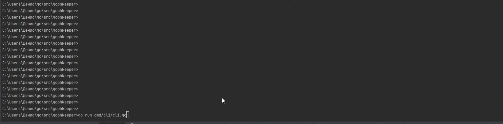

usage: Gophkeeper [<flags>] <command> [<args> ...]

Gophkeeper is a tool for keeping credentials, text data, credit cards and binary
data.

Flags:
  --help                       Show context-sensitive help (also try --help-long
                               and --help-man).
  --access-token=ACCESS-TOKEN  access token is needed to call private methods
  --server-addr="http://localhost:8081"
                               server address

Commands:
  help [<command>...]
    Show help.

  interact
    run client in interactive mode

  sign-up --login=LOGIN --password=PASSWORD
    create new user and login in service

  sign-in --login=LOGIN --password=PASSWORD
    enter the service

  refresh --refresh-token=REFRESH-TOKEN
    refresh access and refresh tokens

  text-get
    get all text data from server

  text-update --id=ID --text=TEXT --metadata=METADATA
    update record

  text-create --text=TEXT --metadata=METADATA
    crate new record

  card-get
    get all card data from server

  card-update --id=ID --card-number=CARD-NUMBER --exp-date=EXP-DATE --cvv=CVV --name=NAME --surname=SURNAME --metadata=METADATA
    update record

  card-create --card-number=CARD-NUMBER --exp-date=EXP-DATE --cvv=CVV --name=NAME --surname=SURNAME --metadata=METADATA
    crate new record

  cred-get
    get all cred data from server

  cred-update --id=ID --login=LOGIN --password=PASSWORD --metadata=METADATA
    update record

  cred-create --login=LOGIN --password=PASSWORD --metadata=METADATA
    crate new record

